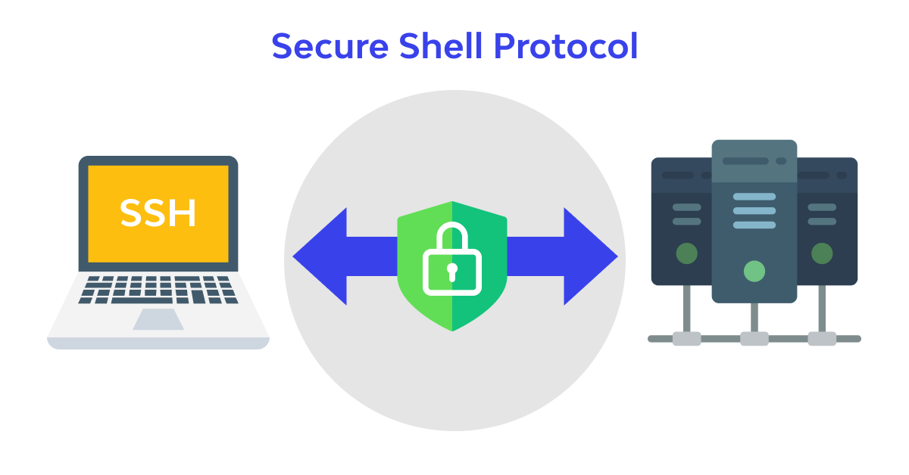

<dl style="margin: 1.5rem 0;">
  <dt style="
    display: flex;
    justify-content: space-between;
    align-items: center;
    gap: 1.5rem;
    font-weight: 500;
    color: #333;
  ">
    <span>Дата публикации:</span>
    
    <a href="./" style="
      color: #374151;
      text-decoration: none;
      font-size: 1rem;
      padding: 0.5rem 1.1rem;
      border: 1px solid #d1d5db;
      border-radius: 6px;
      background: #ffffff;
      transition: all 0.18s ease;
      white-space: nowrap;
      line-height: 1.4;
      flex-shrink: 0;
    ">← Назад</a>
  </dt>
  
  <dd style="
    margin: 0.4rem 0 0 0;
    font-size: 1.05rem;
    color: #111;
  ">
    <time datetime="2026-03-06">06.03.2026</time>
  </dd>
</dl>




## 1. Генерируем современный SSH-ключ

```bash
ssh-keygen -t ed25519 -C "my laptop GitHub"
```

Указываем путь и имя файла, например: `.ssh\id_github_ed25519` (рекомендую не использовать стандартное id_rsa или id_ed25519)


## 2. Получаем публичный ключ и копируем его
#### Вариант 1 — просто посмотреть:
`cat $HOME\.ssh\id_github_ed25519.pub`

#### Вариант 2 — сразу в буфер обмена (самый удобный):
`Get-Content $HOME\.ssh\id_github_ed25519.pub | Set-Clipboard`

## 3. Добавляем ключ на GitHub
1. Переходим → https://github.com/settings/keys
2. Нажимаем зелёную кнопку New SSH key
3. Title: придумываем понятное имя (например: Ноутбук 2025 — ed25519)
4. Вставляем скопированный ключ
5. Нажимаем Add SSH key


## 4. Настраиваем и запускаем SSH-агент в Windows
Проверяем статус:
`PowerShellGet-Service ssh-agent`

Если Stopped → запускаем один раз навсегда:
```bash
PowerShellSet-Service ssh-agent -StartupType Automatic
Start-Service ssh-agent
```

## 5. Добавляем приватный ключ в агент

Показать, какие ключи уже загружены: `ssh-add -l`

Добавить свой ключ (введите пароль, если задавали): `ssh-add $HOME\.ssh\id_github_ed25519`

После успешного добавления команда `ssh-add -l` должна показать строку с вашим ключом.

## 6. Проверяем соединение с GitHub
`PowerShellssh -T git@github.com`
    
#### Ожидаемый ответ:
    
    Hi username! You've successfully authenticated, but GitHub does not provide shell access.

## 7. Исправляем типичную ошибку Windows + OpenSSH
Если при клонировании появляется странная ошибка:

    C:\Windows\System32\OpenSSH\ssh.exe: line 1: C:WindowsSystem32OpenSSHssh.exe: command not found
    fatal: Could not read from remote repository.

Лечится одной командой:
`PowerShellgit config --global core.sshCommand "C:\Windows\System32\OpenSSH\ssh.exe"`

Готово! Теперь можно клонировать репозитории по SSH:
```bash
Bashgit clone git@github.com:username/repository.git
```