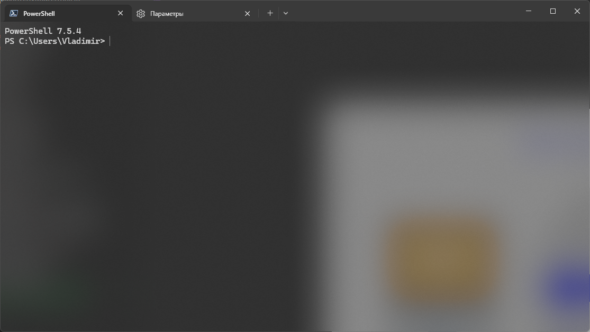

<div style="
  display: flex;
  justify-content: space-between;
  align-items: center;
  gap: 2rem;
  margin: 1.5rem 0;
  font-size: 1.1rem;
">
  <time datetime="2026-03-06" style="color: #444;">06.03.2026</time>
  
  <span style="color: #444; font-weight: normal;">MyWhiteShadow</span>
  
  <div style="display: flex; align-items: center; gap: 1.8rem;">
    <a href="./" style="
      color: #1e40af;
      text-decoration: none;
      padding: 0.45rem 1rem;
      transition: all 0.2s;
      font-size: 0.95rem;
      white-space: nowrap;
    ">Назад</a>
  </div>
</div>



Для пользования конфигом неообходимо:
  1. открыть терминал
  2. нажать на стрелку вниз
  3. нажать кнопку "Открытие файла JSON"
  4. Вставить конфиг
  5. Сохранить файл

```json
{
    "$help": "https://aka.ms/terminal-documentation",
    "$schema": "https://aka.ms/terminal-profiles-schema",
    "actions": 
    [
        {
            "command": 
            {
                "action": "copy",
                "singleLine": false
            },
            "id": "User.copy.644BA8F2"
        },
        {
            "command": "paste",
            "id": "User.paste"
        },
        {
            "command": "find",
            "id": "User.find"
        },
        {
            "command": 
            {
                "action": "splitPane",
                "split": "auto",
                "splitMode": "duplicate"
            },
            "id": "User.splitPane.A6751878"
        }
    ],
    "copyFormatting": "none",
    "copyOnSelect": false,
    "defaultProfile": "{574e775e-4f2a-5b96-ac1e-a2962a402336}",
    "keybindings": 
    [
        {
            "id": "User.copy.644BA8F2",
            "keys": "ctrl+c"
        },
        {
            "id": "User.paste",
            "keys": "ctrl+v"
        },
        {
            "id": "User.find",
            "keys": "ctrl+shift+f"
        },
        {
            "id": "User.splitPane.A6751878",
            "keys": "alt+shift+d"
        }
    ],
    "newTabMenu": 
    [
        {
            "type": "remainingProfiles"
        }
    ],
    "profiles": 
    {
        "defaults": 
        {
            "colorScheme": "Dark+"
        },
        "list": 
        [
            {
                "commandline": "%SystemRoot%\\System32\\WindowsPowerShell\\v1.0\\powershell.exe",
                "guid": "{61c54bbd-c2c6-5271-96e7-009a87ff44bf}",
                "hidden": false,
                "name": "Windows PowerShell"
            },
            {
                "commandline": "%SystemRoot%\\System32\\cmd.exe",
                "guid": "{0caa0dad-35be-5f56-a8ff-afceeeaa6101}",
                "hidden": false,
                "name": "\u041a\u043e\u043c\u0430\u043d\u0434\u043d\u0430\u044f \u0441\u0442\u0440\u043e\u043a\u0430"
            },
            {
                "guid": "{b453ae62-4e3d-5e58-b989-0a998ec441b8}",
                "hidden": false,
                "name": "Azure Cloud Shell",
                "source": "Windows.Terminal.Azure"
            },
            {
                "colorScheme": "Dark+",
                "guid": "{574e775e-4f2a-5b96-ac1e-a2962a402336}",
                "hidden": false,
                "name": "PowerShell",
                "opacity": 49,
                "source": "Windows.Terminal.PowershellCore",
                "useAcrylic": true
            }
        ]
    },
    "schemes": [],
    "themes": []
}
```
